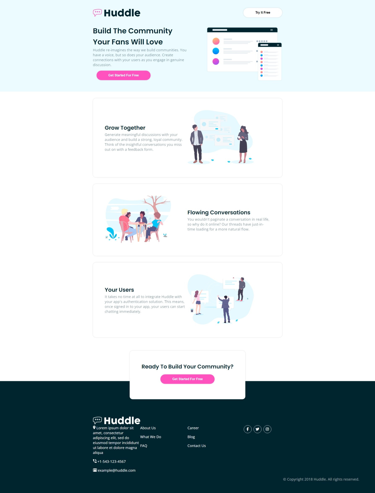

# Frontend Mentor - Huddle landing page with alternating feature blocks solution

This is a solution to the [Huddle landing page with alternating feature blocks challenge on Frontend Mentor](https://www.frontendmentor.io/challenges/huddle-landing-page-with-alternating-feature-blocks-5ca5f5981e82137ec91a5100). Frontend Mentor challenges help you improve your coding skills by building realistic projects. 

## Table of contents

- [Overview](#overview)
  - [The challenge](#the-challenge)
  - [Screenshot](#screenshot)
  - [Links](#links)
- [My process](#my-process)
  - [Built with](#built-with)
  - [What I learned](#what-i-learned)
  - [Continued development](#continued-development)
  - [Useful resources](#useful-resources)
- [Author](#author)
- [Acknowledgments](#acknowledgments)

## Overview

### The challenge

Users should be able to:

- View the optimal layout for the site depending on their device's screen size
- See hover states for all interactive elements on the page

### Screenshot



### Links

- Live Site URL: https://filipesilvait.github.io/huddle-landing-page/

## My process

### Built with

- Semantic HTML5 markup
- CSS custom properties
- Flexbox

### What I learned

I learned how to make the page responsive.

```css
@media screen and (max-width: 768px) {
    body {
        text-align: center;
    }

    nav.flex {
        flex-direction: row;
    }

    .header-img {
        margin-top: 53px;
        margin-left: 0;
        width: 100%;
    }

    .flex {
        flex-direction: column;
    }

    .box-reverse-mobile {
        flex-direction: column-reverse;
    }

    footer ul {
        padding: 0;
        width: 100%;
    }

    footer .p {
        text-align: center;
    }
}
```
### Continued development

I plan to continue learning about HTML and CSS.

### Useful resources

- [flex - CSS: Cascading Style Sheets | MDN (mozilla.org)](https://developer.mozilla.org/en-US/docs/Web/CSS/flex) - This helped me for Flex reason. I really liked this pattern and will use it going forward.

## Author

- Linkedin - https://www.linkedin.com/in/filipesilvait/
- Twitter - [@filipesilvait](https://twitter.com/filipesilvait)

## Acknowledgments

[Florin Pop | LinkedIn](https://www.linkedin.com/in/florinpop17/) helped me
